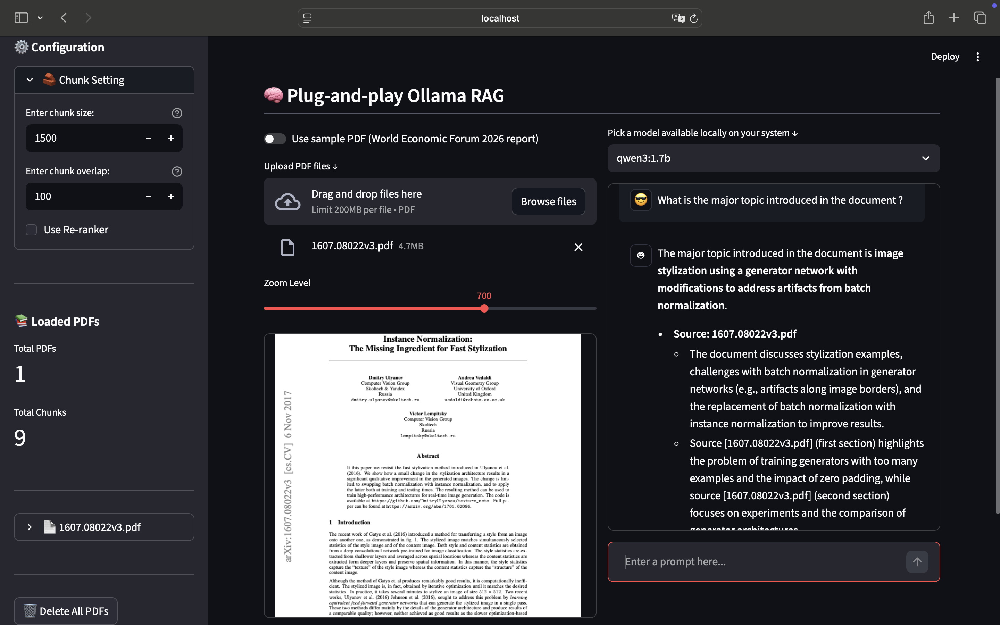

# Plug-and-Play Ollama RAG
A simple and effective RAG pipeline that you can use locally and customise for zero dollar.

## Screenshots


## Features

- 🔒 **100% Local** - All processing logic and data happens on your machine
- 📄 **Multi-PDF Support** - Upload and query across multiple documents
- 🧠 **Multi-Query and re-ranker RAG** - Smarter retrieval with source citations
- 🎯 **Advanced RAG** - LangChain-powered pipeline with ChromaDB
- ⚙️ **Advanced configuration** - Based on your data, tune your RAG for optimal performance by setting chunk size and chunk overlap

## Getting Started

### Prerequisites

1. **Install Ollama**
   - Visit [Ollama's website](https://ollama.com) to download and install
   - Pull required models using your terminal:
     ```bash
     ollama pull qwen3  # or your preferred chat model
     ollama pull nomic-embed-text  # for embeddings with 2K context
     ```

2. **Clone Repository**
   ```bash
   git clone https://github.com/Tohokantche/custom-rag.git
   cd custom-rag
   ```

3. **Set Up Python Environment**
   ```bash
   python -m venv venv
   source venv/bin/activate  # On Windows: .\venv\Scripts\activate
   pip install -r requirements.txt
   ```

4. **Run the application**
   ```bash
    streamlit run main.py
   ```

## Project Structure
```text
custom-rag
├── data
│   ├── pdfs
│   │   └── sample
│   │       └── WEF_Global_Risks_Report_2026.pdf
│   └── vectors
├── LICENSE
├── main.py
├── README.md
├── requirements.txt
├── screenshot.png
└── src
    ├── documents.py
    ├── embeddings.py
    ├── rag.py
    └── utils.py
```

## Contributing

- Open issues for bugs or suggestions
- Submit pull requests
- ⭐ Star the repository if you find it useful!

## License

This project is open source and available under the MIT License.

## Acknowledgments

- [LangChain](https://www.langchain.com/) for the AI agent framework
- [Ollama](https://ollama.com) for advanced search capabilities
- [Streamlit](https://streamlit.io) for the web interface
- [tonykipkemboi](https://github.com/tonykipkemboi/ollama_pdf_rag.git) for the UI inspiration
