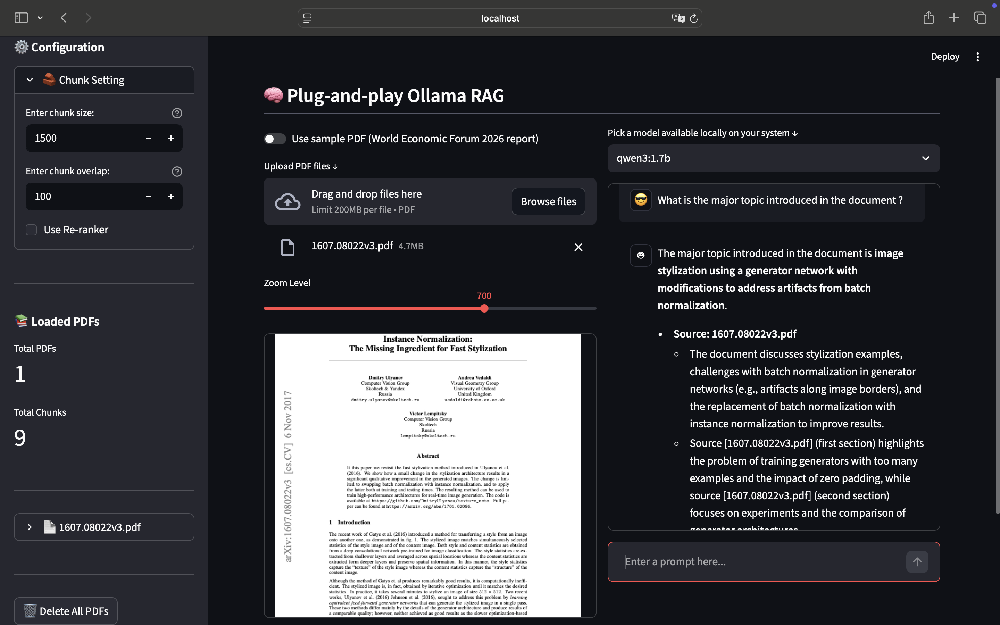

# Plug-and-Play Ollama RAG
A generic and effective RAG pipeline that can be run locally and customised for ZERO (0) dollar. 

## Screenshots


## Features

- 🔒 **100% Local** - All processing logic and data remain on your local machine
- 📄 **Multi-PDF Support** - Upload and query across multiple documents
- 🧠 **Multi-Query RAG** - Smarter and rich retrieval with source citations
- 🔍 **Hybrid search RAG** - Semantic search combined with keyword-based search for accurate retrieval
- 📊 **Re-ranking RAG** - Re-ranking the retrieved documents based on their relevance to the query
- 🛡️ **Queries routing and Guardrails** - Automated routing and handling of toxic/malicious requests 
- 🎯 **Advanced RAG** - LangChain-powered pipeline with ChromaDB 
- ⚙️ **Advanced configuration** - Based on your data, tune the retrieval hyper-parameters for optimal performance 

## Getting Started

### Prerequisites

1. **Install Ollama**
   - Visit [Ollama's website](https://ollama.com) to download and install
   - Pull required models using your terminal:
     ```bash
     ollama pull qwen3.5  # serving as a chat model, feel free to change it to your preferred ones (i.e., I recommend models with smaller hallucination rate for better RAG performance)
     ollama pull nomic-embed-text  # serving as embedding model with 2K context
     ollama pull qwen3:1.7b  # serving as guardrails and to adequately route the user queries 
     ```

2. **Clone Repository**
   ```bash
   git clone https://github.com/Tohokantche/custom-rag.git
   cd custom-rag
   ```

3. **Set Up Python Environment**
   ```bash
   python -m venv venv
   source venv/bin/activate  # On Windows: .\venv\Scripts\activate
   pip install -r requirements.txt
   ```

4. **Run the application**
   ```bash
    streamlit run main.py
   ```

## Project Structure
```text

customag-rag
├── configs                                       # Configuration directory
├── data
│   ├── pdfs                                      # User's uploaded documents directory
│   │   └── sample                                # Sample directory
│   │       └── WEF_Global_Risks_Report_2026.pdf  # Default pdf sample
│   └── vectors                                   # Vector database directory
├── LICENSE                                       # Licence file
├── logs                                          # App log directory
├── main.py                                       # Entry point of the app that contains dynamic UI logic
├── README.md                                     # App documentation and usage file
├── requirements.txt                              # Dependencies file
├── screenshot.png                                # Screenshot of app demo
└── src                                           # Folder that contains app source files
    ├── documents.py                              # Document ingestion logic
    ├── embeddings.py                             # Vector database logic
    ├── rag.py                                    # Actual RAG logic including retrieval, routing and grounding
    └── utils.py                                  # Helper functions including UI sidebar logic
```

## Contributing

- Open issues for bugs or suggestions
- Submit pull requests
- ⭐ Star the repository if you find it useful!

## License

This project is open source and available under the MIT License.

## Acknowledgments

- [LangChain](https://www.langchain.com/) for the AI agent framework
- [Ollama](https://ollama.com) for advanced search capabilities
- [Streamlit](https://streamlit.io) for the web interface
- [tonykipkemboi](https://github.com/tonykipkemboi/ollama_pdf_rag.git) for the UI inspiration
